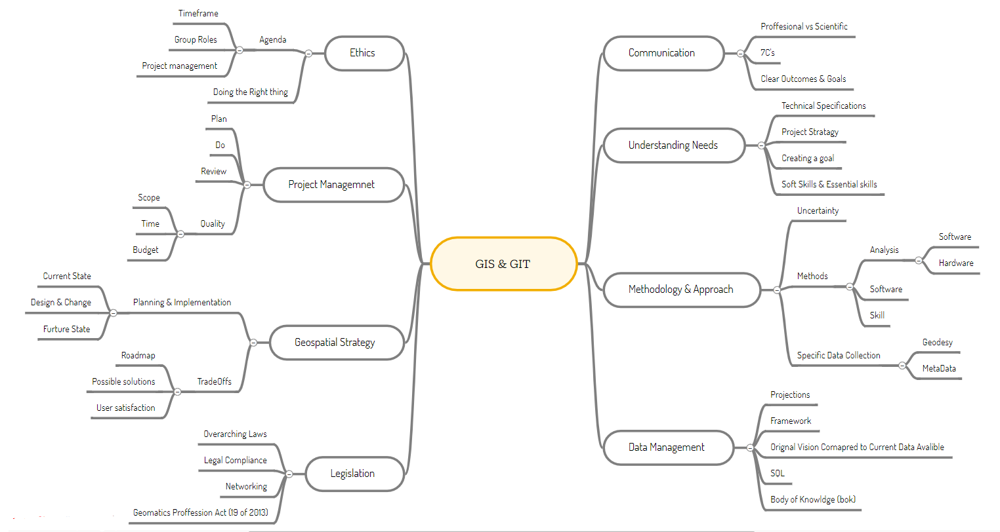
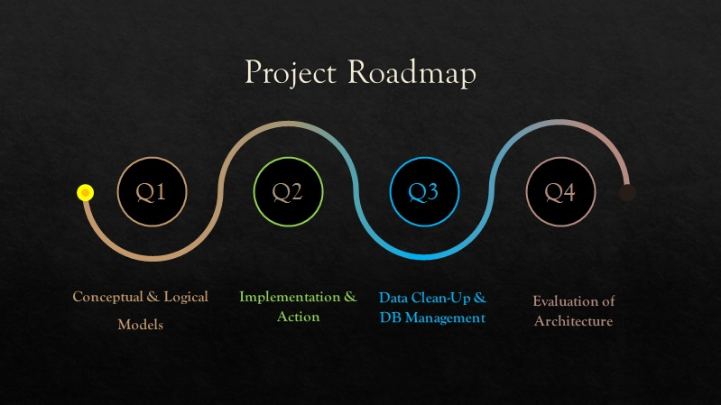
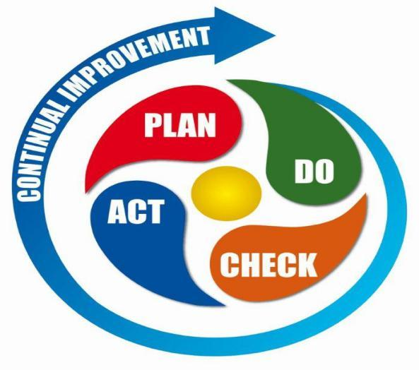
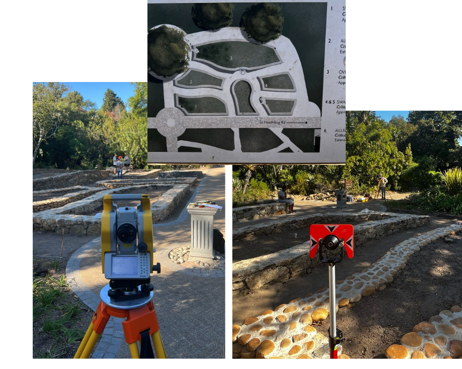
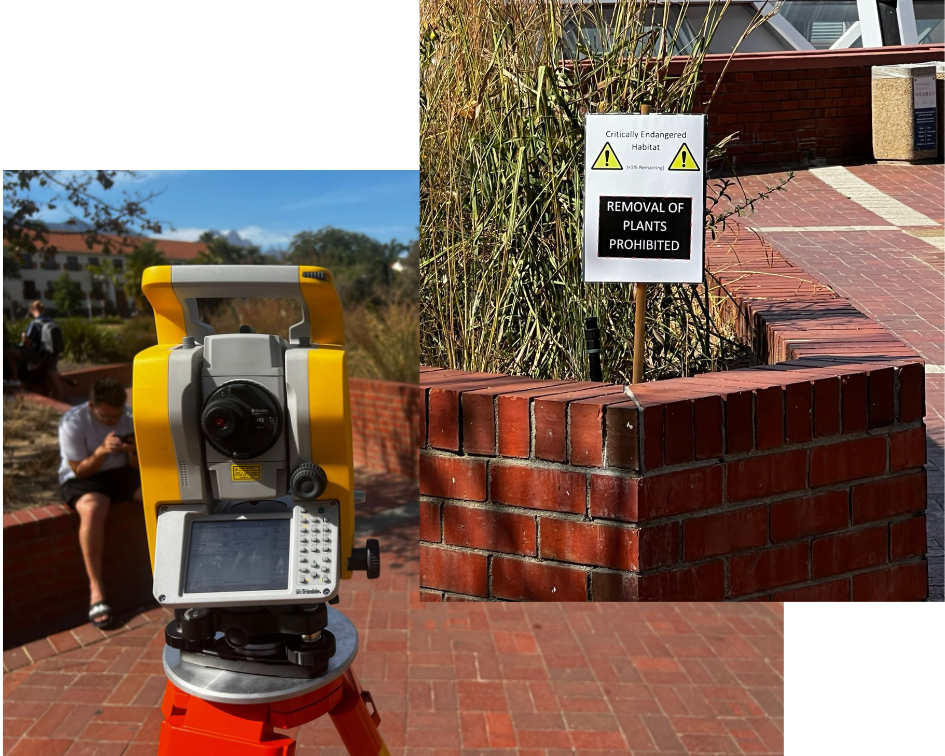
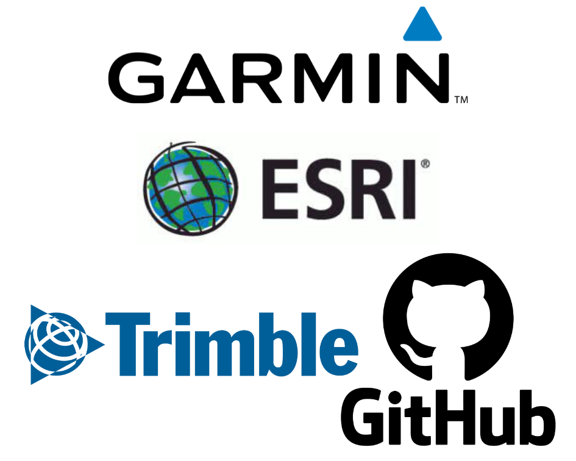

# Welcome To my page and Project report 

Before we dive into details and reflection of Project-1,
Please see the brief introduction and background I have provided
to give you a better understanding of who I am, 
including an attached CV with more details about me, Greg Selles.

### More about Me 

 

Born and raised in a family of five on the coast of Kwa Zulu Natal, I Gregory Michael Selles spent my high school years at Clifton College, where I developed an interest in the natural sciences focusing in Geography, while also experiencing an incredible sporting career in Rugby, Rugby 7s and Cricket.   Today I find myself studying a BSc Geoinformatics and learning more about the outdoors, the culture of our country and the sports that we play.  
                

Please view CV [Click Me](Professional CV - GM Selles.pdf)

# Overview of Report  

    -Project Management 
    -Meeting the Client 
    -GIS Stratagy & Management
    -Data Collect  
    -Data Management 
    -Geodatabase Delivery 
    -Software & Hardware Implmentation

## Concept of GIS

### A Mindmap Overview

The Above MindMap is also available in html form and has been submitted within the submission folder for a clearer view!
  
In order to better understand click on the [pdf](GISmap.pdf) for a brief overview of the various components seen in the mindmap. 

# SU Botanical Gardens Project 

**Client**: Dr. Don Kirkwood (curator of the botanical gardens)  
**Stakeholders**: Stellenbosch University & Associate Lecturers for GIT 713   
**Group Members**: Group3,  Greg Selles, Dom Kennard, Farhaan Essop, Nolu Delman.    
**Deliverables**:  
+ D1: High precision mapping of new garden beds
+ D1-a: Rooi Plane critically endangered species mapping
+ D2: Historical data updating (Geodatabase)
+ D3: Large Tree point mapping
+ D4: Database Integration 
+ D5: Least cost Irrigation mapping    

**Why**:

 To provide an updated Geodatabase to add in the species location mapping of over 4000 different species of plants and provide a historical database to refer back to for garden management.
  

## Business Communication

Similarly, to the concepts discussed in the GIT Overview Pdf, Business and Professional Communication is of highest importance! Being able to understand and extract critical pieces of information  pertaining to a specific problem creates the initial concept and roadmap of the critical path required for the project. 

 Here we learnt how the sharing of ideas and information in a spoken and written manner, start off the project planning process, through the creation of aims which can be turned into achievable goals and set to a time frame in order to remain on the critical path for the project. 
   

 Furthermore, the ability to communicate in the appropriate business dialect has a direct correlation to you as a professional and the standards potential clients expect, which in turn can lead to your success or decline in the working environment. Communication is Key and the correct form of communication paints a good corporate image of yourself and your company. 
 

 Our first meeting with Dr. Kirkwood, took place in a formal room setting where he explained his idea and provided us with a verbal list of goals he would like to achieve, This can be seen above under the Deliverables title for the botanical gardens project. Following which our next meetings took place in the gardens themselves where Dr. Kirkwood explained his current Geodatabase.   Once complete, the various Groups all took turns explaining their conceptual models as to better understand the scope and ensure all the goals set forth had been met. The conceptual model for group 3 can be seen in the link provided. 
  

[Conceptual Model](Group3_ConceptualModel.pdf)

## Importance of Project Management 

 Working in a team requires an understanding of individual roles and clear approach on how to achieve the goals which have been created for the Project. In order to better understand the tasks at hand. We first created a Gannt Chart, in doing such we were able to visually see our goals and compare them to the time frame which had been established. 
 

[Gannt Chart](Group3_Gantt_v2.pdf) 

 The Gannt Chart as seen in the link above provides a meaningful tool for creating a critical path and correctly sub-dividing the task put forward as to ensure that all the goals are in fact achieved within the timeframe allocated.    At this point of the project focus was on the management, planning and creating of aims. It was at this point that we truly understood the Quality of our project was crucially  based on the scope, time, and budget aspect. It should be mentioned that budget in this case did not play a large role as the cost for equipment was null due to the access to equipment which Stellenbosch University and More specifically the Engineering faculty provided. However, this did require the correct Networking and Resource Planning, as the process of book out the equipment was vital to any form of success. 

 Thankfully, this goal was easily achieved and we as a group were now ready to being the implementation and geospatial Strategy portion of our Project.  The Project Roadmap Image below displays the various Goal Titles for different sections of our Project. At this point, we had just achieved the initial step. 
 

## GIS Strategy & Implementation  

 Before we could just run off into the garden and start collecting data for our project. There was some more strategy planning which needed to be considered. Such as devising an appropriate Logical Model to follow and a suitable implementation method such that we could integrate the data collected on site correctly into the Geodatabase of our client, done in such a way as to minimize the duplication or redundancy of data as well as provide more meaning to the database in terms of metadata and accompanying tables of information. 
 

[Logical Model](Logicalmodel.jpg)
 

 To start off our Strategy Planning the link above displays our logical model with appropriate naming conventions as to seamlessly integrate into the database without the error in terms of a duplication of data. 

 Next came the issue of interpreting how to take our ideas and goals, which had been established in meetings, and create a tangible and meaningful product. Moving from this current state of ideas to a more defined future state, required us to focus our skills and sub-divide the tasks into manageable portions which could be separated and achieved. 
 

## Data Collection 

 In order to try and obtain data points at a high precision, we decided to use a Total Station, a piece of surveying equipment which when set up correctly, a process involving identifying the stations exact location as well as identifying a back point from which to calculate distance between the two points. This is achieved through using the built-in laser of the total station and a prism reflector at the points of capture. Once the station is aligned with the prism, the calculations can begin. 
 

 As the station has captured a single point, the user can assess the statistical analysis provided by the machine and choose to save the point to the current project working file. Once saved, the prism can be moved to the next point of interest, and the process continues. 
 

 In order to accurately digitize polygons to match that of the beds seen in the botanical garden, multiple points where captured around each individual bed, as to create a dense point shapefile to add in the data manipulation and management stage. 
    

## Data Manipulation & Analysis

## Geodatabase Delivery

## Software Integration and management 

